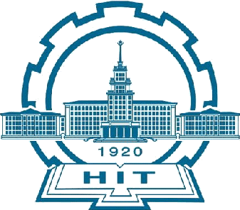

## Background

<table style="width:100%;border:none;border-spacing:0px;border-collapse:separate;margin-right:auto;margin-left:auto;font-size: large">
<tr>
<td style="padding:20px;width:25%;vertical-align:middle;border:none" align="center">
 
</td>
<td style="padding:20px;width:75%;vertical-align:middle;border: none" align="left">
PhD 2022 - Now 
<a href="https://computing.hit.edu.cn/">Department of Computer Science</a> 
<a href="https://www.hit.edu.cn/">Harbin Institute of Technology</a> 
</td>
</tr>
	
<tr>
<td style="padding:20px;width:25%;vertical-align:middle;border:none" align="center">
 
</td>
<td style="padding:20px;width:75%;vertical-align:middle;border: none" align="left">
MSc 2020 - 2021 
<a href="https://www.imperial.ac.uk/computing/">Faculty of Computing</a> 
<a href="https://www.imperial.ac.uk/">Imperial College London</a> 
</td>
</tr>

<tr>
<td style="padding:20px;width:25%;vertical-align:middle;border:none" align="center">
 
</td>
<td style="padding:20px;width:75%;vertical-align:middle;border: none" align="left">
BSc 2018 - 2020 
<a href="https://www.liverpool.ac.uk/mathematical-sciences/">Department of Mathematical Sciences</a> 
<a href="https://www.liverpool.ac.uk/">University of Liverpool</a> 
</td>
</tr>

<tr>
<td style="padding:20px;width:25%;vertical-align:middle;border:none" align="center">
 
</td>
<td style="padding:20px;width:75%;vertical-align:middle;border: none" align="left">
BSc 2016 - 2018 
<a href="https://www.xjtlu.edu.cn/en/study/departments/school-of-mathematics-and-physics/applied-mathematics">Department of Applied Mathematics</a> 
<a href="https://www.xjtlu.edu.cn/en">Xi'an Jiaotong-Liverpool University</a> 
</td>
</tr>
</table>    

<!--I am a PhD student at the [University of Tübingen](https://uni-tuebingen.de/en/fakultaeten/mathematisch-naturwissenschaftliche-fakultaet/fachbereiche/informatik/lehrstuehle/autonomous-vision/home/) under the [ELLIS](https://ellis.eu) program, co-supervised by [Andreas Geiger](http://www.cvlibs.net) and [Torsten Sattler](https://tsattler.github.io). I received my Master's and Bachelor's degree from ShanghaiTech University and Xiamen University, respectively. 

My research focuses on Computer Vision and Machine Learning, espically on 3D Vision (Depth Estimation, Plane Detection, Multi-view Stereo, 3D reconstruction, 3D Human Modeling).

My CV is [here](http://niujinshuchong.github.io/files/CV.pdf). 



Education
======
* **University of Tübingen, Germany (Sept. 2021 - Now)**
	* Ph.D, Computer Science
	* Advisor: Andreas Geiger and Torsten Sattler
* **ShanghaiTech University, China (Aug. 2018 - July 2021)**
	* M.S., Computer Science
	* Advisor: [Shenghua Gao](https://cs.hku.hk/people/academic-staff/gaosh)
*  **Xiamen University, China (Aug 2014 - Jun 2018)**
	* B.E., Software Engineering

Work experience
======
* **Tencent AI Lab, Shenzhen, China, (Mar 2020 - Feb 2021)**
	* Research Intern
	* 3D Human Modeling

Selected publications
======
* **[Gaussian Opacity Fields: Efficient Adaptive Surface Reconstruction in Unbounded Scenes](https://niujinshuchong.github.io/gaussian-opacity-fields/)**
	* **Zehao Yu**, Torsten Sattler, Andreas Geiger
	* ACM Transactions on Graphics, SIGGRAPH ASIA 2024
	* [Project](https://niujinshuchong.github.io/gaussian-opacity-fields/), [Paper](https://arxiv.org/pdf/2404.10772.pdf), [Code](https://github.com/autonomousvision/gaussian-opacity-fields)

* **[2D Gaussian Splatting for Geometrically Accurate Radiance Fields](https://surfsplatting.github.io/)**
	* Binbin Huang, **Zehao Yu**, Anpei Chen, Andreas Geiger, Shenghua Gao
	* ACM SIG International Conference on Computer Graphics (**SIGGRAPH**), 2024
	* [Project](https://surfsplatting.github.io/), [Paper](https://arxiv.org/pdf/2403.17888), [Code](https://github.com/hbb1/2d-gaussian-splatting)

* **[Mip-Splatting: Alias-free 3D Gaussian Splatting](https://niujinshuchong.github.io/mip-splatting/)**
	* **Zehao Yu**, Anpei Chen, Binbin Huang, Torsten Sattler, Andreas Geiger
	* IEEE Conference on Computer Vision and Pattern Recognition (**CVPR**), 2024 (**Oral, Best Student Paper**)
	* [Project](https://niujinshuchong.github.io/mip-splatting), [Paper](https://arxiv.org/pdf/2311.16493.pdf), [Code](https://github.com/autonomousvision/mip-splatting), [Demo](https://niujinshuchong.github.io/mip-splatting-demo)

* **[SDFStudio: A Unified Framework for Surface Reconstruction](https://autonomousvision.github.io/sdfstudio)**
	* **Zehao Yu**, Anpei Chen, Bozidar Antic, Songyou Peng, Apratim Bhattacharyya, Michael Niemeyer, Siyu Tang, Torsten Sattler, Andreas Geiger
	* Open source project, 2022
	* [Project](https://autonomousvision.github.io/sdfstudio), [Code](https://github.com/autonomousvision/sdfstudio)

* **[MonoSDF: Exploring Monocular Geometric Cues for Neural Implicit Surface Reconstruction](https://niujinshuchong.github.io/monosdf/)**
	* **Zehao Yu**, Songyou Peng, Michael Niemeyer, Torsten Sattler, Andreas Geiger
	* Thirty-sixth Conference on Neural Information Processing Systems (**NeurIPS**), 2022
	* [Project](https://niujinshuchong.github.io/monosdf/), [Paper](https://arxiv.org/abs/2206.00665), [Code](https://github.com/autonomousvision/monosdf)

* **[P2Net: Patch-match and Plane-regularization for Unsupervised Indoor Depth Estimation](https://github.com/svip-lab/Indoor-SfMLearner)**
	* **Zehao Yu\***, Lei Jin*, Shenghua Gao
	* European Conference on Computer Vision (**ECCV**), 2020
	* [Paper](https://arxiv.org/pdf/2007.07696.pdf), [Code](https://github.com/svip-lab/Indoor-SfMLearner)

* **[Fast-MVSNet: Sparse-to-Dense Multi-View Stereo With Learned Propagation and Gauss-Newton Refinement](https://github.com/svip-lab/FastMVSNet)**
	* **Zehao Yu**, Shenghua Gao
	* IEEE Conference on Computer Vision and Pattern Recognition (**CVPR**), 2020
	* [Paper](https://arxiv.org/pdf/2003.13017.pdf), [Code](https://github.com/svip-lab/FastMVSNet)

* **[Single-Image Piece-wise Planar 3D Reconstruction via Associative Embedding](https://github.com/svip-lab/PlanarReconstruction)**
	* **Zehao Yu\***, Jia Zheng*, Dongze Lian, Zihan Zhou, Shenghua Gao
	* IEEE Conference on Computer Vision and Pattern Recognition (**CVPR**), 2019
	* [Paper](https://arxiv.org/pdf/1902.09777.pdf), [Code](https://github.com/svip-lab/PlanarReconstruction)

Professional Services
======
* Journal Reviewer: <i> IEEE Transactions on Circuits and Systems for Video Technology (TCSVT) </i>
* Journal Reviewer: <i> IEEE Transactions on Image Processing (TIP) </i>
* Conference Reviewer: <i> Association for the Advancement of Artificial Intelligence (AAAI) </i>
-->
